# 오라클 데이터베이스 프로젝트 - 스타벅스 벤치마킹

# 📖 Introduction

### 1.프로젝트 개요 

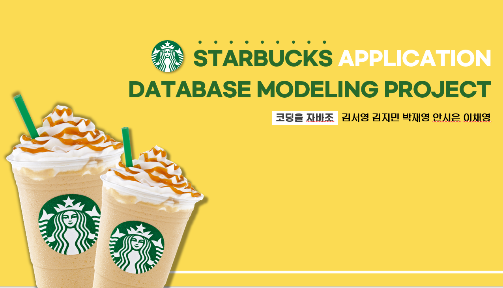

- 대기업의 정형화된 시스템에 주목하여 요구분석을 먼저 진행하였습니다. 
- 그 후에 개념적 , 논리적, 물리적 모델링을 진행하였습니다. 
- 업무를 분담하여 요구분석에 알맞는 쿼리를 작성하였습니다. 

### 2. 개발 환경

- 본프로젝트는 주로 PL/SQL을 사용하여 진행하였습니다. 

- ER-다이어그램은 draw.io를, ERD는 exERD를, 쿼리작성은 SQL Developer를 사용하였습니다.

  

## 🙋‍♂️함께한 팀원

- 김지민
- 김서영
- 박재영
- 안시은
- 이채영

## 📃개념적 모델링 

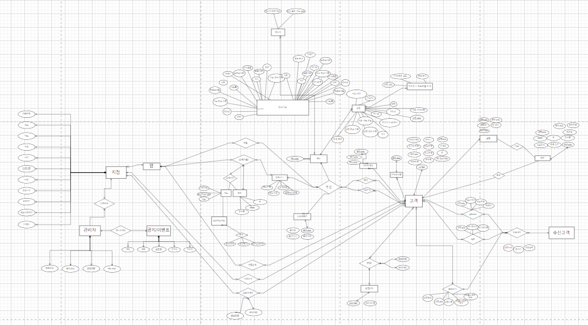

## 🌞논리적 모델링
<a href="https://github.com/Jim3-4/Starbucks_OracleProject/blob/main/2%EC%A1%B0_%EC%8A%A4%ED%83%80%EB%B2%85%EC%8A%A4_exerd.exerd">
 논리적 모델링 파일로 자세하게 보기 
</a>

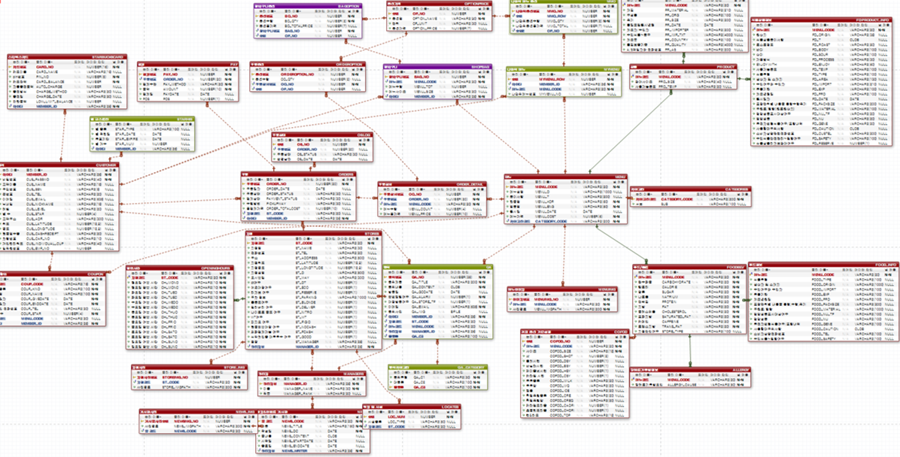

 다음과 같이 설계하였습니다. 테이블은  총33개로 구성되어 있습니다.

## 🙋 My Role

**회원관련**

- 인증코드발행+일치하는지
- 회원가입
- 로그인
- 회원프로필
- 레벨출력
- 회원탈퇴
- 회원정보수정 패키지
- 영수증출력

**관리자관련**

- 매니저정보출력
- 게시글쓰기
- 게시글출력
- 메뉴등록
- 메뉴삭제
- 메뉴수정

**결제**

- 분할결제 

# 🔎 Detail

**주요코드 살펴보기**

 

✔️**개인정보수집에 대한 동의여부, 신상정보를** **입력받고** **랜덤한** **인증번호 발행** 
 
<a href="https://github.com/Jim3-4/Starbucks_OracleProject/blob/main/1%ED%9A%8C%EC%9B%90%EA%B4%80%EB%A0%A8/1%EC%9D%B8%EC%A6%9D%EC%BD%94%EB%93%9C%EB%B0%9C%ED%96%89_%EC%9D%BC%EC%B9%98%ED%95%98%EB%8A%94%EC%A7%80sql.sql">코드 링크</a>  

개인정보 수집에 대한 동의 여부를 텍스트로 입력하고,  신상정보를 입력받으면 
전역변수에 인증번호가 발생되고, print로 인증번호를 출력합니다. 
사용자는 대체변수를 입력하는 입력창에  인증번호를 입력하면 
다음과 같이 일치하는지 확인합니다. 

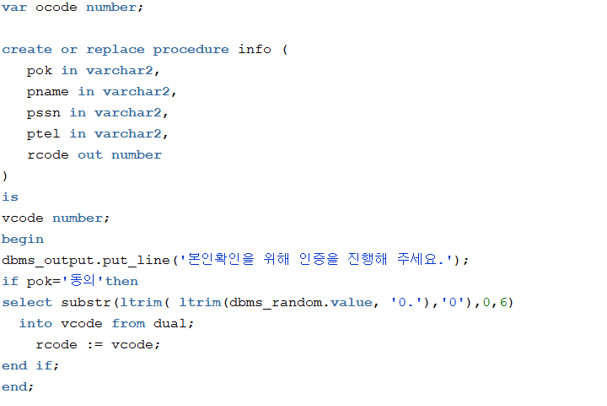

**결과**

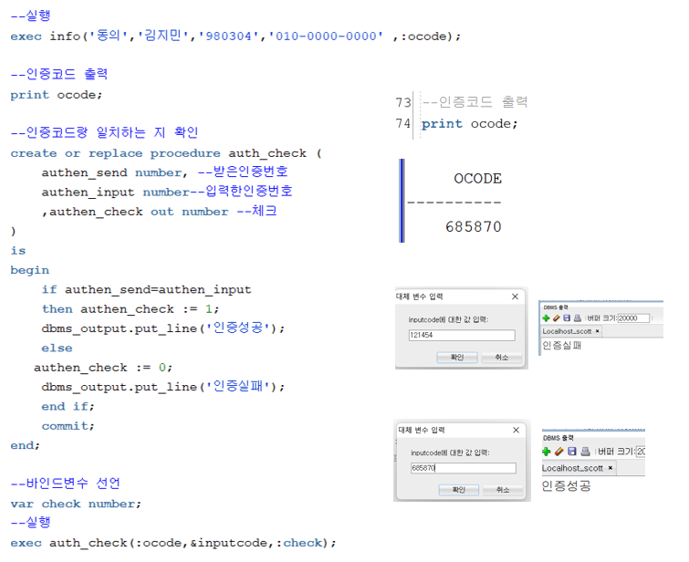

✔️**회원가입**

회원가입에서는  select문으로 아이디가 존재하는지, 아이디 중복여부를 확인하고, 양식에 맞게 입력하였는지 확인합니다. 
양식에 맞지 않으면 다음과 같이 회원가입을 할 수 없습니다. 

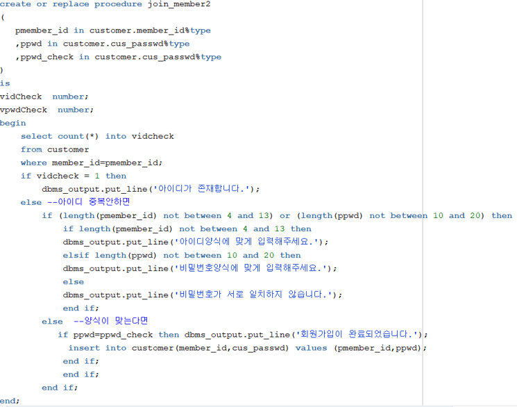

**결과**

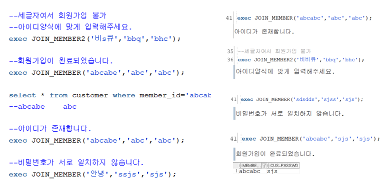

**✔️로그인**

select문으로 아이디가 존재하는지 체크를 하고 , 아이디와 비밀번호가 일치하면 다음과 같이  로그인에 성공합니다.

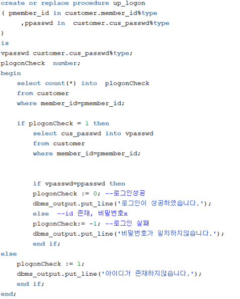

**결과**

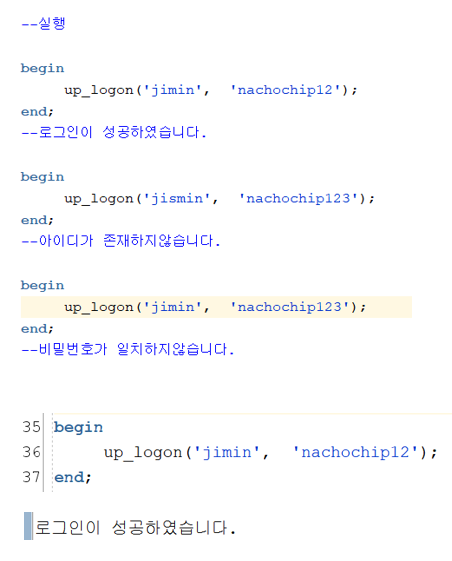

**✔️회원정보수정**

회원정보 수정하는 기능입니다.어플에서는 생년월일,  이메일 , 현금영수증 번호만 변경이 가능하고 나머지 정보는 *로 가려서 출력되는 기능입니다. 

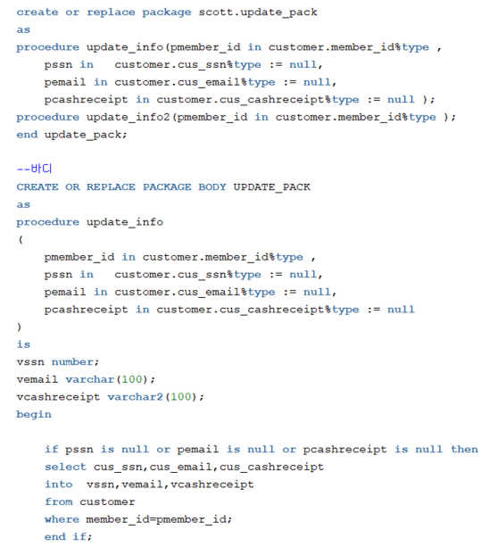

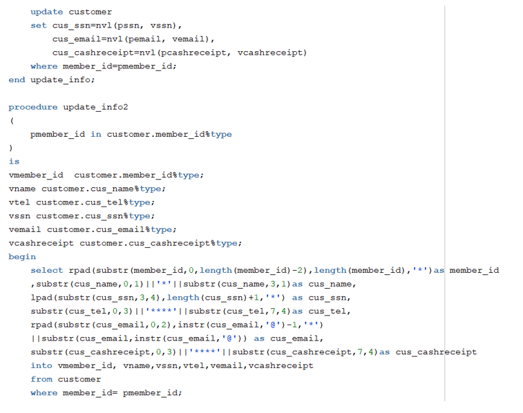

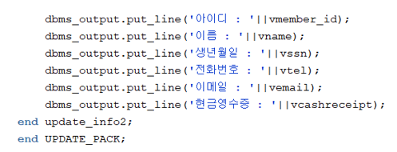

**결과**

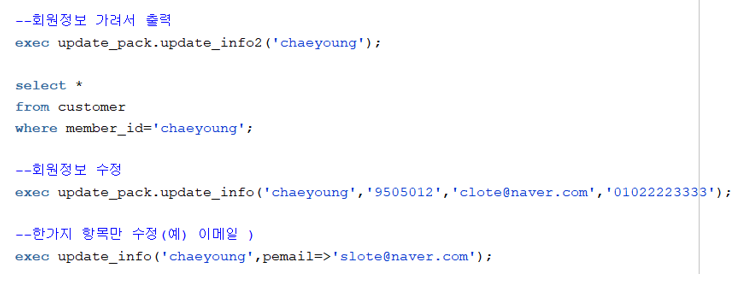

✔️**카드 분할 결제 시 차감 (스타벅스 카드 잔액에서 차감, 잔액이 부족할 경우 결제 불가)**

주문번호를 입력하면 해당 결제수단과 해당금액이 출력되고, 포인트와 유사한 스타벅스카드를 사용했을 시에는 사용한 금액만큼 스타벅스카드잔액에서 
차감됩니다.  

분할 결제가 아닐시에도 가능합니다(일반카드로만 결제시). 

패키지로 프로시저 2개를 묶어놨는데  하나는 스타벅스카드결제 프로시저고, 다른 하나는  스타벅스카드가 아닌 , 다른 결제수단 프로시저로 이루어져있습니다. 
그래서 분할 결제가 아닐시에는 카드 종류에 해당하는 프로시저를 실행하면 됩니다. 

패키지를 사용한 이유는 유사한 업무에 사용되는 여러 개의 프로시저나 함수를 하나의 패키지로 묶어서 관리해야 자신이 필요한 항목을 찾는게 더 수월해지기 때문입니다. 패키지를 사용하면 자유 사용되는 프로그램과 로직을 모듈화 할 수 있기 때문에 유지보수 작업이 편해지고 프로그램의 처리흐름을 노출되지 않기에 보안기능이 향상될 수 있습니다. 

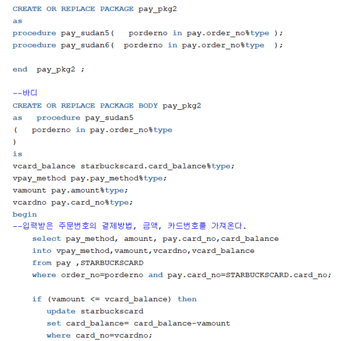

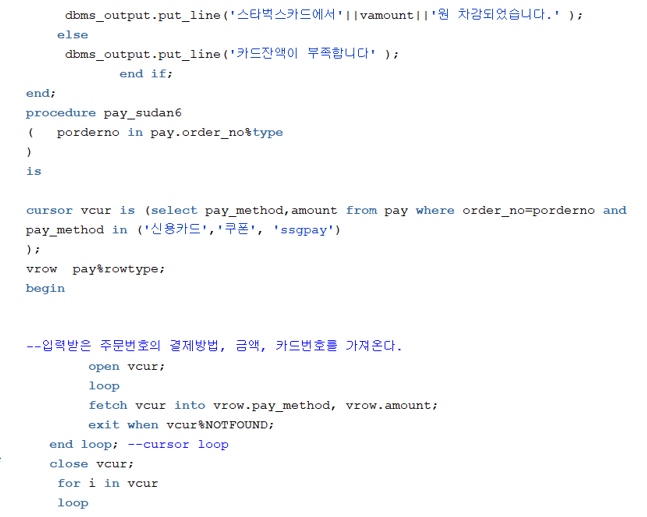

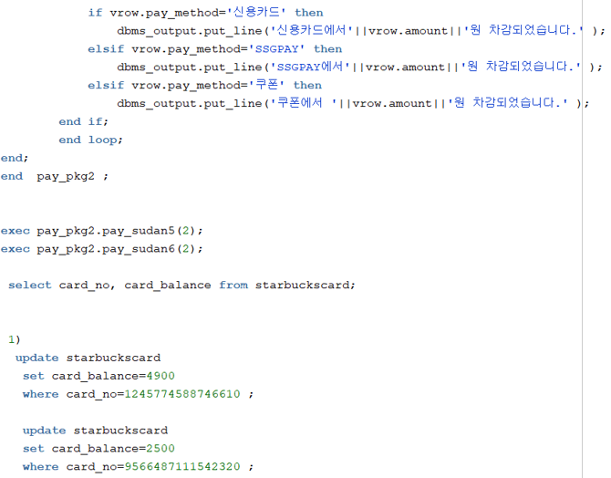

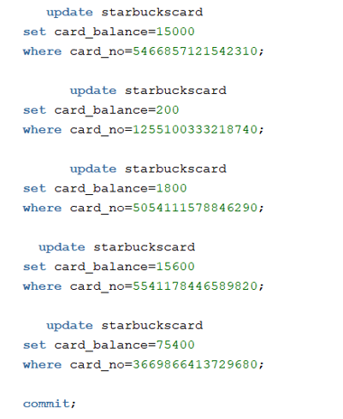

**결과**

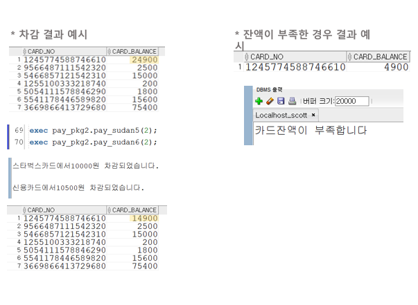

## 💡 느낀점

- DB 작업시 기초 ERD 설계가 정말 중요하고 , 조금이라도 잘못 짜여졌을시 그 후에 파장이 정말 크다는것 느꼈습니다.
- 쿼리를 진행해보니, 필요했던 칼럼들을 빠트린 것도 있었고, 테이블에 cascade와 같이, 부모 데이터를 삭제하면 자식도 자동으로 삭제되는 제약조건을 설정하지 않아서 프로시저들을 실행시키고 데이터를 원상복구하는데에 어려움이 있었습니다.
- 팀원분들도 열정적이고 자신이 임무맡은 바를 열심히 해내려고 해서 촉박한 시간안에서도 구현하기로 목표한 기능들을 모두 구현할 수 있었습니다. 위 두 과정에서 팀플의 중요성을 다시 한번 깨달았습니다. 예를 들어 오늘 할당량을 다 못끝내면 쉬는시간을 줄였습니다.
- 좋은 팀원분들을 만나서 서로 조언도 많이 해주고, 에러도 서로 같이 잡아주고 했습니다. 이 과정에서 같이 고민을 하다보니 제가 몰랐던 것을 다른 팀원이 채워주고 다른 팀원이 몰랐던 것을 내가 채워주는 상호작용 효과가 일어난 부분이 좋았습니다.
